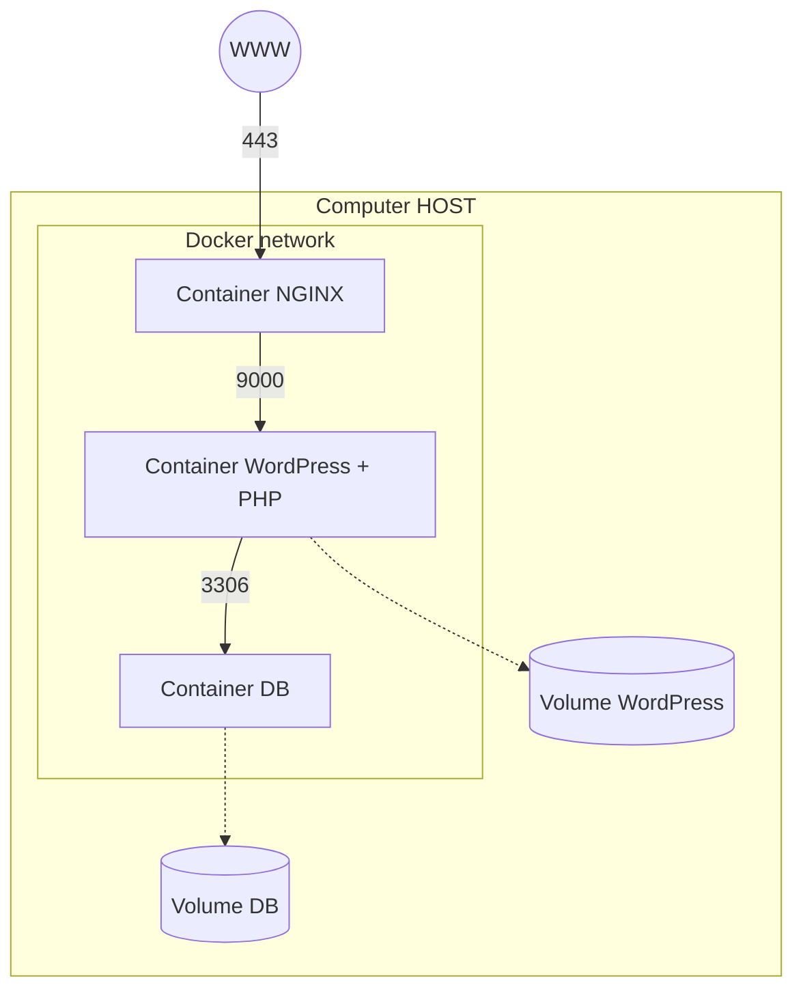

*This project has been created as part
of the 42 curriculum by lgracia-*

# Description
Inception is a systems administration project designed to deepen knowledge of virtualization through the use of Docker. The main objective is to build a complete, secure, and reproducible microservices infrastructure, composed of an NGINX server (TLSv1.2/v1.3), WordPress with PHP-FPM, and MariaDB.

The project emphasizes security and isolation, prohibiting the use of pre-built images or tools like DockerHub for the main services (except for the base Alpine/Debian image). Each service runs in a dedicated container, communicating exclusively through a private Docker network.




## Proyect arquitecture
```
.  
├── Makefile  
├── secrets/                  # For confidential information  
├── srcs/  
│   ├── .env.example          # Environment variables  
│   ├── docker-compose.yml    # Service configuration  
│   └── requirements/  
│       ├── mariadb/  
│       │   ├── Dockerfile  
│       │   └── tools/setup.sh  
│       ├── nginx/  
│       │   ├── Dockerfile  
│       │   ├── conf/nginx.conf  
│       │   └── tools/setup.sh  
│       └── wordpress/  
│           ├── Dockerfile  
│           └── tools/setup.sh  
├── README.md                 # General proyect information  
├── USER_DOC.md               # User documentation  
└── DEV_DOC.md                # Developer documentation  
```
## Concept omparisons
#### 1. Virtual Machines vs Docker
| Feature | Virtual Machines | Docker |
| :--- | :--- | :--- |
| **Architecture** | Full OS per instance with its own kernel | Shares the host OS kernel |
| **Resource Usage** | Heavy (requires GBs of RAM and disk) | Lightweight and highly efficient |
| **Startup Time** | Slow (minutes to boot) | Near-instant (seconds) |
| **Isolation** | Hardware-level (Hypervisor) | OS-level (Namespaces and Cgroups) |

**Project feature**: This proyect is developed inside a virtualBox machine (Alpine Linux 3.22) for subject mandation and over everything, sudo rights.

#### 2. Secrets vs Environment Variables
| Feature | Docker Secrets | Environment Variables |
| :--- | :--- | :--- |
| **Security** | Encrypted in transit and at rest | Plain text (visible in `docker inspect`) |
| **Data Type** | Sensitive data (passwords, API keys) | Non-sensitive configuration data |
| **Access Control** | Restricted to specific services | Accessible to all processes in the container |
| **Storage** | Mounted as files in `/run/secrets/` | Often stored in the `.env` file |

**Project feature**: Following the subject's security requirements, **Docker Secrets** is used for database and WordPress passwords to ensure they are never hardcoded or stored in plain text within the repository.

#### 3. Docker Network vs Host Network
| Feature | Docker Network (Bridge) | Host Network |
| :--- | :--- | :--- |
| **Isolation** | Fully isolated and private | No isolation from the host system |
| **DNS Resolution** | Services communicate by name | Must use Host IP and specific ports |
| **Security** | High (only explicit ports are exposed) | Low (all container ports are open on host) |
| **Subject Rule** | **Mandatory** | **Forbidden** |

**Project feature**: custom **Docker Bridge Network** to allow secure, name-based communication between MariaDB, WordPress, and NGINX, ensuring that only NGINX is reachable from the outside on port 443.

#### 4. Docker Volumes vs Bind Mounts
| Feature | Docker Volumes (Named) | Bind Mounts |
| :--- | :--- | :--- |
| **Management** | Managed entirely by Docker | Managed by the host's filesystem |
| **Portability** | High (independent of host paths) | Low (tied to host directory structure) |
| **Permissions** | Docker handles correct ownership | Can cause permission conflicts with host |
| **Subject Rule** | **Mandatory** for WP and DB | **Forbidden** for persistent storage |

**Project feature**: **Named Docker Volumes** are used to persist the WordPress files and MariaDB database, ensuring that data is safely stored in `/home/login/data` as required by the subject [1-3].

# Instructions
Requirements: A Linux virtual machine (Alpinex in this case) with Docker, Docker Compose, and Make installed.
1. Set up the environment file as the .env.example and secrets
2. Build and start: `make`
3. Access the site:
    - Web: https://lgracia-.42.fr
    - Admin: https://lgracia-.42.fr/wp-admin/

# Resources
- [Docker Documentation](https://docs.docker.com/compose/gettingstarted)
- [MariaDB Troubleshooting Guide](https://mariadb.com/docs/server/mariadb-quickstart-guides/mariadb-connection-troubleshooting-guide)
- [Alpine Linux Release Notes](https://wiki.alpinelinux.org/wiki/Release_Notes_for_Alpine_3.22.0?__goaway_challenge=cookie&__goaway_id=5b3323ced841b57638dedb57c6e2d55f&__goaway_referer=https%3A%2F%2Fnotebooklm.google.com%2F)

## AI Usage
The use of ai was used for the management of the resources, by feeding the Ai the resources and steping righ to the wanted information of the source. 
There where also three main development problems to mention that it was really usuful for:
- Network error resolution: Identification and correction of the --skip-networking flag in MariaDB that caused the port: 0 error [Conversation].
- Healthchecks debugging: Configuration of mariadb-admin ping and cgi-fcgi commands to ensure the correct startup order [Conversation].
- NGINX configuration: Solution to the file visibility issue by mapping the wordpress_data volume in the NGINX service [Conversation].

It also was of assistance in the technical writing of required comparisons and organization of the README.

# Additional information
## Technical choices
All the choices where made for minimal memory and resource use.
- VirtaulBox: Alpine Linux system, chosen for its light and secure advantatge over debian.
- Docker: docker-compose and Alpine Linux 3.22, maraidb and wordpress base images as required by the proyect
- Makefile: for docker-compose construction and clenup.

## Feature list
This are some basic limitations by the subject that characterize this proyect.

| Feature rquired | Solution |
| :--- | :--- |
| **Single Entry Point** | NGINX acts as the only service exposed externally through port 443 |
| **Network Isolation** | Implementation of an internal bridge network called inception. MariaDB and WordPress do not expose ports to the host, making them inaccessible outside the internal network. |
| **Data Persistence** | Named Volumes bind-mounted on /home/lgracia-/data are used to ensure that files and the database survive container restarts. |
| **Process Management** | Each container launches its main service as PID 1 through entrypoint scripts that prevent infinite loops or unstable patches. |
| **Prohibition of the tag `latest`** | Specific versions have been set in the Dockerfiles (e.g., alpine:3.18 and mariadb:10.11) to ensure environment reproducibility. |
| **Credential Management** | Use of a /secrets directory structure outside the code tree. Passwords are mounted as read-only files, complying with the prohibition of plaintext secrets in Git. |
| **TLS v1.2/v1.3** | Strict configuration in the NGINX files, disabling previous versions to comply with modern security standards. |
| **WP User Rules** | Logical validation in entrypoint.sh that prevents the creation of administrators with names containing "admin" or "administrator". |
